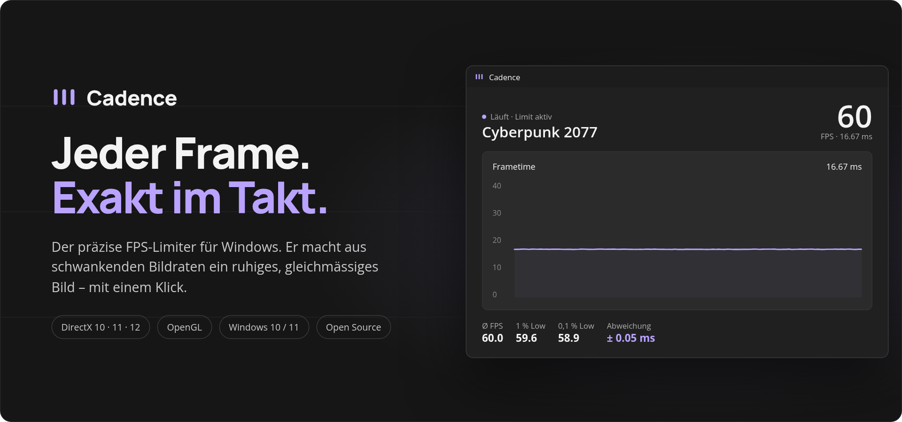
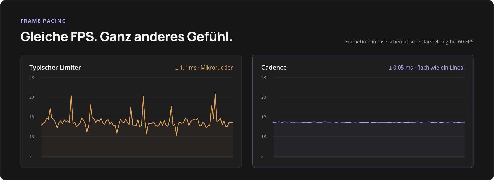
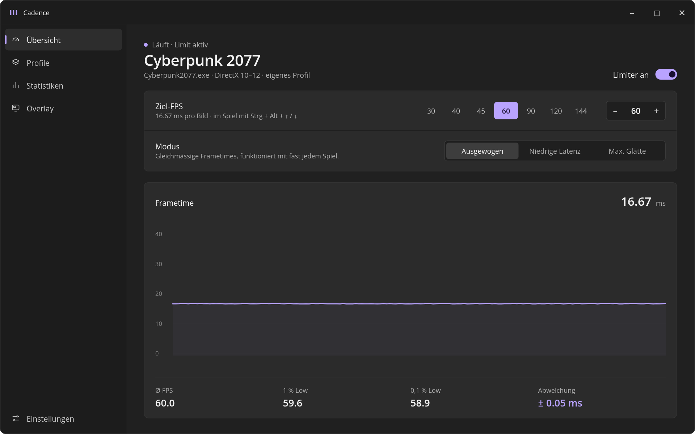
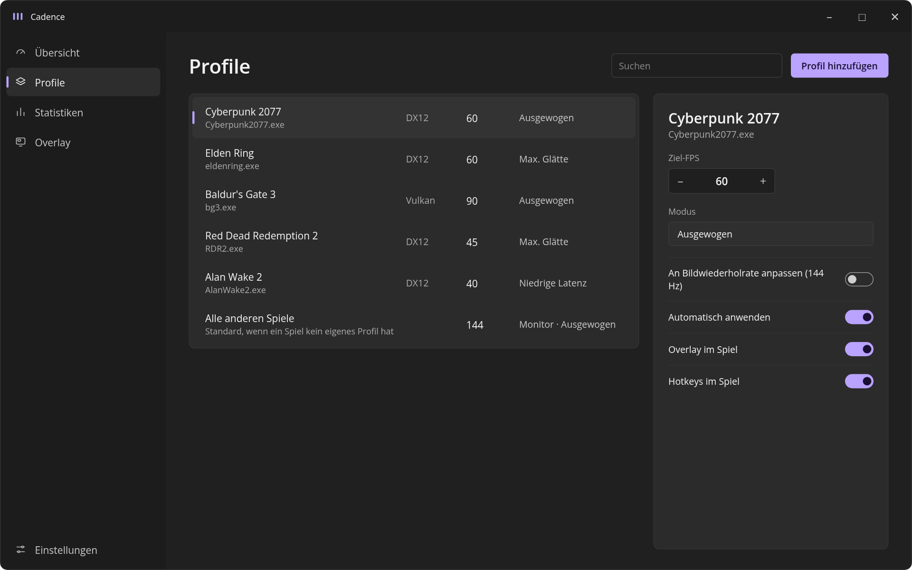
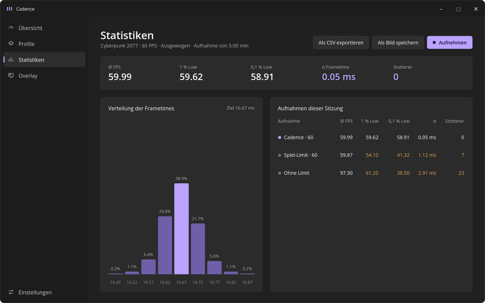
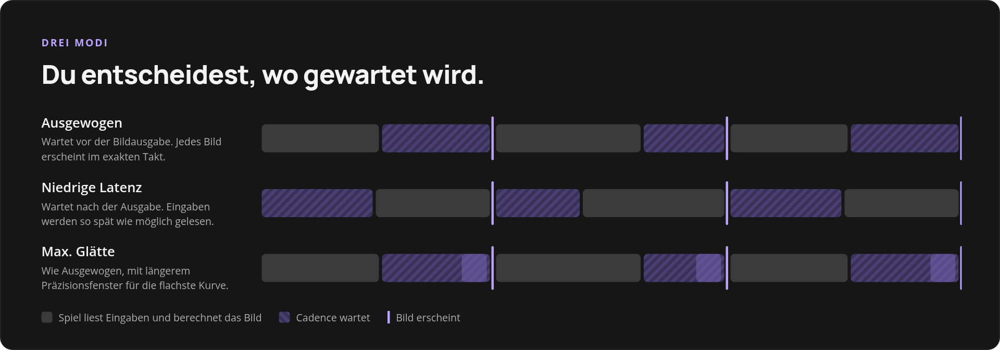
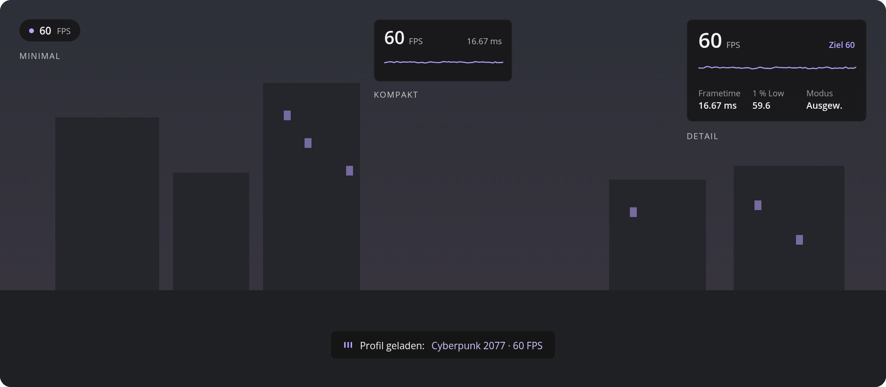
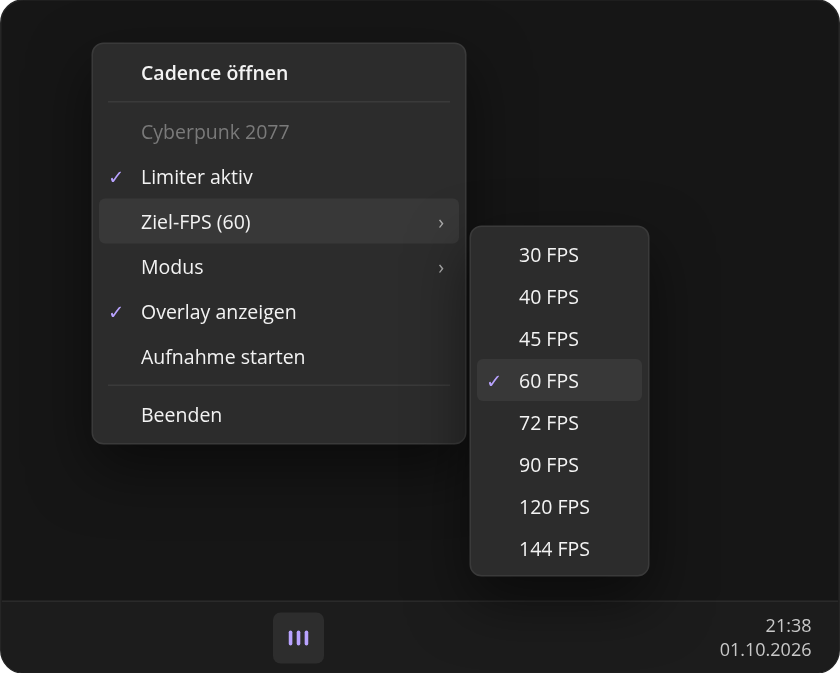
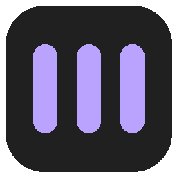

  

  
  
  
  

  <b><a href="#so-legst-du-los">Loslegen</a></b> ·
  <a href="#funktionen">Funktionen</a> ·
  <a href="#so-funktioniert-cadence">So funktioniert's</a> ·
  <a href="#die-werte-erklärt">Werte erklärt</a> ·
  <a href="#das-richtige-ziel-finden">Das richtige Ziel</a> ·
  <a href="#häufige-fragen">FAQ</a> ·
  <a href="docs/BUILD.md">Selbst bauen</a>

 

## Warum fühlen sich 30 FPS auf der Konsole flüssig an – und am PC nicht?

Die Antwort ist nicht die Bildrate, sondern **der Abstand zwischen den Bildern**.

Ein FPS-Zähler zeigt einen Durchschnitt. Er sagt nichts darüber, ob jedes Bild nach genau 16,67 ms kommt oder abwechselnd nach 12 und nach 21 ms. Genau dieses Schwanken spürst du als Mikroruckler, auch wenn oben rechts konstant „60“ steht. Konsolen takten ihre Bilder deshalb streng. Am PC übernehmen das meist ungenaue Limiter im Spiel oder im Treiber.

**Cadence bringt diesen Takt auf den PC.** Es hält jedes Bild auf den Bruchteil einer Millisekunde genau ein. Das Ergebnis: dieselbe Bildrate, aber ein spürbar ruhigeres Spielgefühl.

  

 

## Funktionen

<table>
<tr>
<td width="50%" valign="top">

### Präzises Frame Pacing
Cadence wartet auf einem hochauflösenden Windows-Timer und gleicht die letzten Mikrosekunden aktiv aus. Statt einer zappelnden Kurve bekommst du eine flache Linie.

</td>
<td width="50%" valign="top">

### Live ändern, ohne Neustart
Ziel-FPS und Modus wirken sofort, auch mitten im Spiel. Mit <kbd>Strg</kbd> + <kbd>Alt</kbd> + <kbd>↑</kbd> / <kbd>↓</kbd> wechselst du die Stufe, ohne das Spiel zu verlassen. Alle Tastenkürzel lassen sich frei belegen.

</td>
</tr>
<tr>
<td valign="top">

### Profile pro Spiel
Jedes Spiel bekommt seine eigenen Werte, etwa 40 FPS für Cyberpunk und 90 für Baldur's Gate. Cadence erkennt das Spiel beim Start und lädt das Profil automatisch.

</td>
<td valign="top">

### Passt sich deinem Monitor an
Für alle Spiele ohne eigenes Profil gilt automatisch die Bildwiederholrate deines Hauptbildschirms. Neuer Monitor? Cadence merkt es von selbst.

</td>
</tr>
<tr>
<td valign="top">

### Overlay im Spiel
FPS, Frametime und ein Mini-Graph direkt über dem Spiel. Drei Varianten, frei wählbare Ecke, durchklickbar. Ein- und ausblenden mit <kbd>Strg</kbd> + <kbd>Alt</kbd> + <kbd>O</kbd>.

</td>
<td valign="top">

### Messen statt raten
Aufnahme per <kbd>Strg</kbd> + <kbd>Alt</kbd> + <kbd>R</kbd>, danach Ø FPS, 1 % und 0,1 % Lows, Streuung und Stotterer auf einen Blick. Zwei Aufnahmen gegeneinanderstellen und die Unterschiede in Prozent sehen, Export als CSV oder Bild.

</td>
</tr>
<tr>
<td valign="top">

### Kühler, leiser, sparsamer
Wer nicht hunderte überflüssige Bilder berechnet, spart Strom und Wärme. Die frei gewordene Leistung steckst du in höhere Grafikdetails.

</td>
<td valign="top">

### Schutz vor Anti-Cheat-Sperren
Cadence prüft jedes Spiel vor dem Start auf Anti-Cheat-Systeme und hält sich bei einem Treffer konsequent heraus.

</td>
</tr>
</table>

 

## Eine App, die sich wie Windows anfühlt

Cadence ist mit WinUI 3 gebaut, der Oberfläche von Windows 11 selbst: Mica-Hintergrund, flüssige Übergänge, dunkles Design mit lila Akzent. Keine überladene Gaming-Software, sondern ein Werkzeug, das sich ins System einfügt.

  

<table>
<tr>
<td width="50%" valign="top">
  
  
<b>Profile</b> – jedes Spiel mit eigenem Ziel und Modus

</td>
<td width="50%" valign="top">
  
  
<b>Statistiken</b> – Aufnahmen auswerten und vergleichen

</td>
</tr>
</table>

 

## Die drei Modi

  

| Modus | Ideal für | Kurz erklärt |
|---|---|---|
| **Ausgewogen** | fast alles | Cadence wartet direkt vor der Bildausgabe. Jedes Bild erscheint im exakten Takt. |
| **Niedrige Latenz** | schnelle Spiele mit Maus | Cadence wartet nach der Ausgabe. Das Spiel liest deine Eingaben dadurch so spät wie möglich, das senkt den Input-Lag. |
| **Max. Glätte** | Controller-Spiele mit 30–60 FPS | Wie Ausgewogen, aber mit längerem Präzisionsfenster. Die flachste Kurve, für etwas mehr CPU-Last. |

 

## So funktioniert Cadence

Jedes Spiel meldet Windows ein fertiges Bild mit einem einzigen Aufruf, bei DirectX heisst er `Present`, bei OpenGL `SwapBuffers`. Genau dort setzt Cadence an:

1. **Einklinken.** Beim Start eines Spiels lädt Cadence eine kleine DLL in den Spielprozess und hängt sich vor diesen Aufruf. Am Spiel selbst wird nichts verändert, keine Datei auf der Festplatte wird angefasst.
2. **Takt halten.** Will das Spiel ein Bild ausgeben, prüft Cadence, wie viel Zeit seit dem letzten vergangen ist. Ist das Bild zu früh dran, wartet Cadence. Zuerst schläft es auf einem hochauflösenden Windows-Timer, die letzten Mikrosekunden zählt es aktiv herunter. So geht jedes Bild auf den Bruchteil einer Millisekunde genau raus.
3. **Messen.** Für jedes Bild schreibt die DLL die tatsächliche Bildzeit in einen gemeinsamen Speicherbereich. Daraus entstehen der Live-Graph, das Overlay und die Statistiken.
4. **Loslassen.** Beendest du Cadence, laufen alle Spiele sofort wieder unbegrenzt. Stürzt Cadence ab, merkt die DLL das am fehlenden Lebenszeichen und gibt das Limit nach spätestens zwei Sekunden frei.

> [!IMPORTANT]
> Ein Limiter kann ein Spiel nur **bremsen**, nie beschleunigen. Cadence macht die Bildzeiten gleichmässig, indem es schnelle Bilder auf das Ziel verzögert. Ein Bild, das ohnehin länger braucht, kann es nicht schneller machen. Darum ist die Wahl des Ziels so wichtig, mehr dazu unter [Das richtige Ziel finden](#das-richtige-ziel-finden).

 

## Die Werte erklärt

**Frametime** (Bildzeit) ist die wichtigste Grösse in Cadence: wie viele Millisekunden ein einzelnes Bild dauert. Sie ergibt sich direkt aus der Bildrate, **1000 ÷ FPS = ms pro Bild**. 60 FPS sind 16,67 ms, 90 FPS 11,11 ms, 144 FPS 6,94 ms. Wichtig: Die Frametime ist **nicht** die Latenz. Mehr dazu in den [häufigen Fragen](#häufige-fragen).

| Wert | Was er bedeutet | Worauf achten |
|---|---|---|
| **Ziel-FPS** | Die Bildrate, die Cadence einhält. Darunter steht die passende Bildzeit, etwa „11.11 ms pro Bild“. | Muss unter dem liegen, was das Spiel dauerhaft schafft. |
| **Ø FPS** | Durchschnittliche Bildrate über die Messung. | Sagt wenig über das Spielgefühl. Zwei Messungen mit gleichem Schnitt können sich völlig verschieden anfühlen. |
| **1 % Low** | Die Bildrate der langsamsten 1 % aller Bilder. Technisch: 1000 ÷ das 99. Perzentil der Bildzeiten. | Je näher am Ziel, desto seltener spürbare Einbrüche. |
| **0,1 % Low** | Dasselbe für die langsamsten 0,1 %, also die seltenen, aber deutlichen Hänger. | Der ehrlichste Wert für Mikroruckler. Ein grosser Abstand zum Schnitt bedeutet kurze Hänger. |
| **σ Frametime** | Die Standardabweichung der Bildzeiten: Wie stark weicht ein Bild im Schnitt von den anderen ab? | **Der wichtigste Wert für Glätte.** Unter 0,1 ms ist praktisch perfekt, ab etwa 1 ms spürt man Unruhe. |
| **Stotterer** | Bilder, die länger als das Doppelte der mittleren Bildzeit gebraucht haben. | Idealerweise 0. Einzelne Treffer beim Nachladen sind normal. |
| **Verteilung** | Das Histogramm zeigt, wie viel Prozent der Bilder in welchem Bildzeit-Bereich lagen. Der hervorgehobene Balken liegt auf dem Ziel, „Balken 0,03 ms“ ist die Breite eines Balkens. | Ein einziger hoher Balken bedeutet gleichmässigen Takt. Ein breiter Hügel oder zwei Gipfel bedeuten Schwanken. |
| **Gestrichelt** | Beim Vergleich zweier Aufnahmen zeigt der gestrichelte Umriss die Verteilung der Vergleichsaufnahme. | So sieht man auf einen Blick, wie viel enger die Bilder mit Cadence liegen. |

Im **Overlay** und auf der **Übersicht** gelten dieselben Werte, nur laufend über die letzten Sekunden berechnet. Der Wert mit „±“ ist dort die Streuung σ.

 

## Das richtige Ziel finden

Die Faustregel: **Ziel unter dem wählen, was das Spiel dauerhaft schafft.** Ein guter Startwert ist knapp unter dem 1 % Low, den das Spiel ohne Limit erreicht.

Warum das so wichtig ist, zeigen zwei echte Messungen im selben Spiel, jeweils mit dem Modus „Niedrige Latenz“:

**Ziel zu hoch: 144 FPS, das Spiel schafft aber nur rund 127**

| | Ø FPS | 1 % Low | 0,1 % Low | σ Frametime | Stotterer |
|---|---|---|---|---|---|
| Ohne Cadence | 126,98 | 98,64 | 82,44 | 0,95 ms | 0 |
| Cadence auf 144 | 127,33 | 97,68 | 84,03 | 2,27 ms | 3 |

Hier wird es mit Cadence **unruhiger**. Schnelle Bilder werden auf 6,94 ms gebremst, langsame bleiben bei rund 8,6 ms. Die Bildzeiten springen zwischen zwei Werten hin und her, im Histogramm sieht man zwei Gipfel statt einem.

**Ziel erreichbar: 90 FPS**

| | Ø FPS | 1 % Low | 0,1 % Low | σ Frametime | Stotterer |
|---|---|---|---|---|---|
| Ohne Cadence | 89,97 | 77,48 | 54,16 | 0,78 ms | 1 |
| Cadence auf 90 | 90,00 | **89,12** | **87,22** | **0,04 ms** | **0** |

Gleicher Durchschnitt, aber ein ganz anderes Spielgefühl. Die Streuung sinkt um 95 %, 95,5 % aller Bilder liegen im selben 0,03-ms-Fenster, und der 0,1 % Low steigt von 54 auf 87 FPS. Die kurzen Hänger verschwinden fast vollständig.

Cadence nimmt dir das Rechnen ab:

- **Hinweis bei zu hohem Ziel.** Verfehlt das Spiel das Ziel über mehrere Sekunden immer wieder, zeigt die Übersicht „Ziel wird nicht erreicht“ mit einer Empfehlung. Ein Klick übernimmt sie.
- **Vorher/Nachher-Vergleich.** Nimm dieselbe Szene einmal mit Limiter aus und einmal mit Limiter an auf. Unter **Statistiken → Vergleichen mit …** siehst du die Unterschiede in Prozent und beide Verteilungen übereinander.

 

## Overlay im Spiel

  

Kurze Hinweise blenden sich ein, wenn ein Profil geladen wird, wenn du Ziel oder Modus änderst und während einer Aufnahme. Das Overlay funktioniert im Fenster- und im randlosen Vollbildmodus.

 

## Immer griffbereit im Tray

<table>
<tr>
<td width="45%" valign="middle">
  
</td>
<td width="55%" valign="middle">

Beim Minimieren verschwindet Cadence in den Infobereich der Taskleiste. Ein Rechtsklick genügt, um:

- den Limiter ein- oder auszuschalten
- Ziel-FPS und Modus zu wechseln
- das Overlay ein- oder auszublenden
- eine Aufnahme zu starten
- Cadence zu beenden

Beim Beenden laufen alle Spiele sofort wieder unbegrenzt. Selbst wenn Cadence abstürzt, gibt das Spiel das Limit nach spätestens zwei Sekunden frei.

</td>
</tr>
</table>

 

## Die perfekte Einrichtung

1. **Ein erreichbares Ziel wählen.** Lieber stabile 60 als schwankende 70 bis 90, siehe [Das richtige Ziel finden](#das-richtige-ziel-finden). Schalte andere FPS-Limits im Spiel und im Treiber ab, damit sich nichts in die Quere kommt.
2. **Zum Monitor passend synchronisieren.** Mit G-Sync oder FreeSync (VRR) genügt das Limit. Bei einem Monitor mit fester Bildwiederholrate V-Sync im Spiel einschalten, damit es nicht zu Tearing kommt.
3. **Bewegungsunschärfe einschalten.** Sie füllt die Lücken zwischen den Bildern wie die Belichtung einer Kamera und glättet schnelle Kameraschwenks.
4. **Zum Controller greifen.** Analogsticks bewegen die Kamera gleichmässig. Mit der Maus fallen niedrige Bildraten viel stärker auf.

> [!TIP]
> Auf 120-Hz-Bildschirmen sind **40 FPS** ein Geheimtipp: Jedes Bild bleibt exakt drei Bildwechsel lang stehen. Das fühlt sich deutlich runder an als 45 oder 50 FPS.

 

## So legst du los

1. **[Neueste Version herunterladen](../../releases/latest)** (`Cadence-Setup-x.y.z.exe`) und installieren. Keine Admin-Rechte nötig.
2. Cadence starten.
3. Ein Spiel starten. Läuft es im Vollbild, schlägt Cadence vor, es zu begrenzen. Alternativ unter **Profile → Profil hinzufügen**.
4. Ziel-FPS wählen. Fertig.

> [!NOTE]
> Cadence ist noch nicht digital signiert. Windows SmartScreen zeigt deshalb beim ersten Start „Der Computer wurde durch Windows geschützt“. Klicke auf **Weitere Informationen → Trotzdem ausführen**. Lieber selbst bauen? Siehe **[Bauen und testen](docs/BUILD.md)**.

**Systemanforderungen:** Windows 10 22H2 oder Windows 11 (64-Bit) · 64-Bit-Spiele mit DirectX 10, 11, 12 oder OpenGL · empfohlen: Monitor mit G-Sync oder FreeSync

 

## Tastenkürzel

| Kürzel | Wirkung |
|---|---|
| <kbd>Strg</kbd> + <kbd>Alt</kbd> + <kbd>↑</kbd> / <kbd>↓</kbd> | Ziel-FPS eine Stufe höher / tiefer |
| <kbd>Strg</kbd> + <kbd>Alt</kbd> + <kbd>R</kbd> | Aufnahme starten / stoppen |
| <kbd>Strg</kbd> + <kbd>Alt</kbd> + <kbd>O</kbd> | Overlay ein- / ausblenden |

Das sind die Standardwerte. Unter **Einstellungen → Tastenkürzel** legst du jede Aktion auf eine eigene Kombination.

 

> [!WARNING]
> **Nicht in Online-Spielen mit Anti-Cheat verwenden** (z. B. Easy Anti-Cheat, BattlEye, Vanguard, VAC). Cadence klinkt sich in das Spiel ein, und solche Systeme können das als Manipulation werten. Cadence erkennt viele dieser Spiele und hält sich dann heraus. Die Erkennung ist aber keine Garantie. Die Nutzung erfolgt auf eigenes Risiko.

 

## Häufige Fragen

<b>Warum nicht einfach das Limit im Spiel nutzen?</b>

 

Viele Limiter in Spielen schlafen mit einer Genauigkeit von etwa einer Millisekunde. Das reicht für den Durchschnitt, aber nicht für einen gleichmässigen Takt. Manche Spiele bieten auch nur 30, 60 oder „unbegrenzt“ an. Cadence erlaubt jeden Wert und hält ihn genauer ein.

Ehrlich gesagt: Ein sehr gut gebauter Limiter im Spiel, vor allem zusammen mit NVIDIA Reflex oder AMD Anti-Lag, kann beim Input-Lag besser sein. Für schnelle Shooter mit Maus lohnt sich ein Vergleich. Mit der Statistik-Seite von Cadence siehst du den Unterschied direkt.

<b>Sind die Millisekunden die Latenz?</b>

 

Nein. Die angezeigten ms sind die **Bildzeit**, also der Abstand zwischen zwei Bildern (1000 ÷ FPS). Die **Latenz** ist die Zeit vom Mausklick bis zur sichtbaren Reaktion auf dem Bildschirm. Sie hängt mit der Bildzeit zusammen, ist aber meist ein Mehrfaches davon, weil Eingabe, CPU, GPU und Bildschirm nacheinander arbeiten.

Cadence misst die Latenz nicht direkt, dafür bräuchte es Werkzeuge wie NVIDIA Reflex oder ein Messgerät am Monitor. Der Modus „Niedrige Latenz“ senkt sie trotzdem: Das Spiel wartet vor dem Einlesen deiner Eingabe statt danach, die Eingabe ist also frischer, wenn das Bild erscheint.

<b>Ich habe ein hohes Limit gesetzt, aber es läuft unruhiger als ohne. Warum?</b>

 

Das Spiel schafft das Ziel nicht. Cadence bremst dann nur die schnellen Bilder, die langsamen bleiben langsam, und die Bildzeiten springen hin und her. Senke das Ziel unter das, was das Spiel dauerhaft erreicht. Cadence weist dich in der Übersicht darauf hin und schlägt einen Wert vor. Läuft das Spiel mit V-Sync auf einem 144-Hz-Monitor, ist es ausserdem auf 144 FPS gedeckelt. Ein Limit darüber hat dann keine Wirkung.

<b>Und der Limiter im Grafiktreiber?</b>

 

Der funktioniert überall, ist aber oft nicht so präzise und verlangt bei manchen Treibern einen Neustart des Spiels, damit Änderungen greifen. Cadence ändert das Ziel live, speichert Werte pro Spiel und zeigt dir, wie gleichmässig es tatsächlich läuft.

<b>Kostet Cadence Leistung?</b>

 

Kaum. Die Hook-DLL ist wenige hundert Kilobyte gross und arbeitet nur beim Wechsel zum nächsten Bild. Im Modus „Max. Glätte“ ist die CPU-Last etwas höher, weil Cadence länger aktiv auf den exakten Zeitpunkt wartet.

<b>Warum sehe ich das Overlay nicht?</b>

 

Im exklusiven Vollbild lässt Windows keine anderen Fenster über dem Spiel zu. Stelle das Spiel auf „Randlos“ bzw. „Borderless“. Mit VRR ist das ohnehin meist die bessere Wahl.

<b>Welche Spiele werden unterstützt?</b>

 

64-Bit-Spiele mit DirectX 10, 11, 12 oder OpenGL. Vulkan und 32-Bit-Spiele sind in Arbeit.

 

## Was als Nächstes kommt

- [x] Präziser Limiter mit drei Modi
- [x] Profile pro Spiel und automatische Erkennung
- [x] Overlay, Tray, Statistiken mit Export
- [x] Ziel-FPS passend zum Monitor
- [x] Frei belegbare Tastenkürzel, Benachrichtigungen, Update-Hinweis in der App
- [x] Hinweis bei unerreichbarem Ziel mit Empfehlung
- [x] Vorher/Nachher-Vergleich in der Statistik
- [ ] Vulkan-Unterstützung
- [ ] 32-Bit-Spiele
- [ ] Automatisch knapp unter der Bildwiederholrate bleiben, wenn VRR aktiv ist
- [x] Installer mit automatischen Releases
- [ ] Digitale Signatur

Ideen oder Fehler gefunden? Eröffne ein [Issue](../../issues). Bitte gib Spiel, Grafik-API und den Status aus der Übersicht an.

 

   
  Cadence · gebaut für alle, die ein ruhiges Bild mehr schätzen als eine hohe Zahl.

